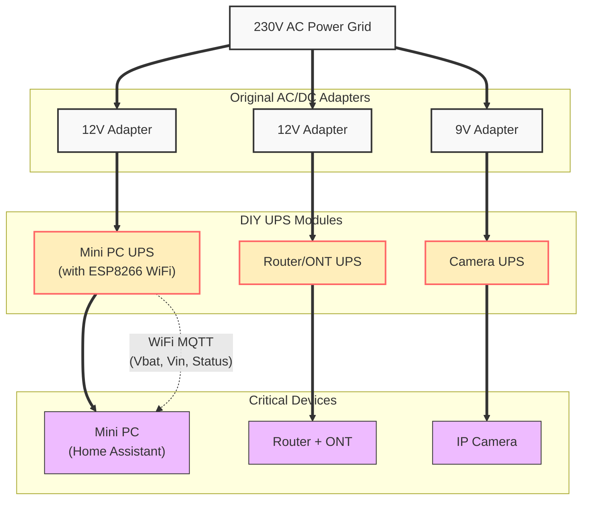
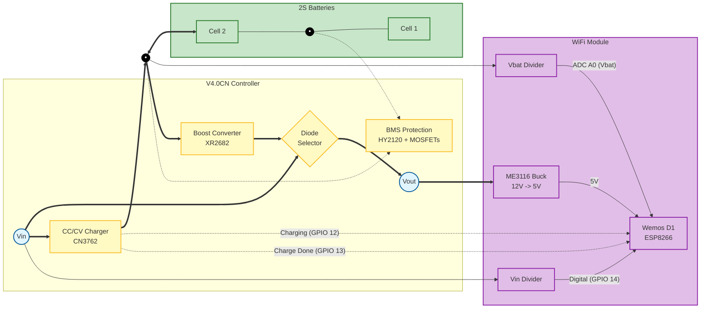

# DIY UPS Project: Uninterruptible Power Supply for Smart Home Devices

---

## Introduction

This document describes the design, construction, and configuration of a set of homemade, modular, and low-cost **Uninterruptible Power Supplies (UPS)**, intended to provide power backup to critical devices in a smart home installation.

The main objective is to keep devices such as **Mini PCs**, **Routers**, **ONTs**, and **IP Cameras** operational during power outages, ensuring:

- **Home network continuity** for receiving alarm notifications.
- **1-2 hours of autonomy** for most devices.
- **Remote monitoring** of battery and power grid status via **Home Assistant** (MQTT).

The design is based on **18650 batteries** and low-cost **commercial controller modules**, resulting in compact, affordable units (~€10-15/unit) that are easy to adapt to different devices.

---

## Table of Contents

- [DIY UPS Project: Uninterruptible Power Supply for Smart Home Devices](#diy-ups-project-uninterruptible-power-supply-for-smart-home-devices)
  - [Introduction](#introduction)
  - [Table of Contents](#table-of-contents)
  - [1. Requirements Analysis](#1-requirements-analysis)
    - [1.1 Devices to Protect](#11-devices-to-protect)
    - [1.2 Functional Requirements](#12-functional-requirements)
  - [2. System Architecture](#2-system-architecture)
    - [2.1 General Topology](#21-general-topology)
    - [2.2 Global System Block Diagram](#22-global-system-block-diagram)
      - [Flow Description](#flow-description)
  - [3. Hardware Design and Development](#3-hardware-design-and-development)
    - [3.1 Main Controller Selection](#31-main-controller-selection)
    - [3.2 Internal Controller Architecture (V4.0CN)](#32-internal-controller-architecture-v40cn)
    - [3.3 Controller Block (V4.0CN)](#33-controller-block-v40cn)
      - [3.3.3 Boost Converter (XR2682)](#333-boost-converter-xr2682)
      - [3.3.4 Circuit Modifications (Boost Fix)](#334-circuit-modifications-boost-fix)
    - [3.4 2S Battery Pack Block](#34-2s-battery-pack-block)
      - [Technical Specifications (Samsung INR18650-35E)](#technical-specifications-samsung-inr18650-35e)
    - [3.5 WiFi Module and Signals Block](#35-wifi-module-and-signals-block)
      - [3.5.2 Signal Interface (Monitoring)](#352-signal-interface-monitoring)
        - [3.5.2.1 Input Voltage Monitoring (Vin)](#3521-input-voltage-monitoring-vin)
        - [3.5.2.2 Battery Voltage Monitoring (Vbat)](#3522-battery-voltage-monitoring-vbat)
      - [3.5.3 Microcontroller (Wemos D1 Mini)](#353-microcontroller-wemos-d1-mini)
    - [3.6 Built Models and BOM](#36-built-models-and-bom)
      - [3.6.1 Enclosures and Finished Models](#361-enclosures-and-finished-models)
      - [3.6.2 UPS Model Definition](#362-ups-model-definition)
      - [3.6.3 Cost and Materials Analysis (BOM)](#363-cost-and-materials-analysis-bom)
    - [3.7 Autonomy and Performance Estimates](#37-autonomy-and-performance-estimates)
  - [4. Configuration and Home Assistant Integration](#4-configuration-and-home-assistant-integration)
    - [4.1 Tasmota Configuration](#41-tasmota-configuration)
      - [4.1.1 Backup and Restore](#411-backup-and-restore)
      - [4.1.2 Manual Configuration (Generic 18)](#412-manual-configuration-generic-18)
      - [4.1.3 Console Commands](#413-console-commands)
      - [4.1.4 MQTT Rules](#41-mqtt-rules)
    - [4.3 Home Assistant Integration](#43-home-assistant-integration)
      - [4.3.1 YAML Configuration (Sensors and Templates)](#431-yaml-configuration-sensors-and-templates)
      - [4.3.2 Native Tasmota Integration](#432-native-tasmota-integration)
      - [4.3.3 Example Automations](#433-example-automations)
    - [4.4 Logical Monitoring States](#44-logical-monitoring-states)
  - [5. Testing and Performance](#5-testing-and-performance)
  - [6. Annexes and References](#6-annexes-and-references)
    - [6.1 Component Datasheets](#61-component-datasheets)


---

## 1. Requirements Analysis

### 1.1 Devices to Protect

**5 critical devices** were identified that must remain operational during a power outage:

| #    | Device       | Model                 | Voltage | Consumption   | Original Charger | WiFi  |
| :--- | :----------- | :-------------------- | :-----: | :------------ | :--------------: | :---: |
| 1    | Mini PC      | BMAX B3 (Intel N5095) |   12V   | 9W (20W peak) |       24W        |  Yes  |
| 2    | Router       | TC7230.O              |   12V   | 15W           |       30W        |  No   |
| 3    | IP Camera    | Tapo C210             |   9V    | ~5W           |       5.4W       |  No   |
| 4    | Router + ONT | Zyxel ex3301-t0 + ZTE |   12V   | ~18W + 6W     |       24W        |  No   |
| 5    | Mini PC      | ACE Magician T8PLUS   |   12V   | ~10W          |       30W        |  Yes  |

### 1.2 Functional Requirements

1. **Minimum Autonomy:** 1-2 hours per device.
2. **Seamless Switching:** The device must not reboot during the grid/battery transition.
3. **Monitoring (optional):** Report to Home Assistant:
   - Power grid status (present/absent).
   - Battery charge level.
   - Charging status (charging/charged).
4. **Compactness:** Small enclosure to be placed next to the device.
5. **Low Cost:** <€15 per unit.

---

## 2. System Architecture

### 2.1 General Topology

The system uses a **simplified DC-Online topology**. The load is always connected to the circuit, and energy flows through two possible paths:

1. **Grid Present:** AC/DC Adapter → Battery Charger + Load (via diode).
2. **Grid Absent:** Battery → Boost Converter → Load.

### 2.2 Global System Block Diagram

The following diagram illustrates the general system architecture in the home environment, detailing the power flow and communications for monitoring in Home Assistant.



#### Flow Description
1. **Power Supply:** Each device uses its original adapter. The UPS is inserted between the adapter and the device.
2. **Monitoring:** The Mini PC UPS (which consumes more and is critical) includes a WiFi module that sends telemetry (battery voltage, grid presence) via MQTT.
3. **Integration:** The Router manages the local network, allowing the UPS MQTT message to reach the Home Assistant server (hosted on the Mini PC), closing the monitoring loop.

---

## 3. Hardware Design and Development

### 3.1 Main Controller Selection

Several commercial UPS module options were evaluated. The analyzed boards are shown below:

| Option |                   Image                   | Characteristics                           |    Output Power    | Decision                                       |
| :----: | :---------------------------------------: | :---------------------------------------- | :----------------: | :--------------------------------------------- |
| **1**  |  | **LX-2BSAI (Green)**. 5V USB-C Input. 1S. |        ~15W        | Discarded (Low power/5V in).                   |
| **2**  |  | **3S Lithium UPS**. 12V. 3S Batteries.    |        ~30W        | Discarded (Requires 3 cells, large enclosure). |
| **3**  |  | **NDUP1APA (White)**. 9V Output. 1S.      |        ~15W        | **Selected** for Camera (9V).                  |
| **4**  |  | **DC SAI V4.0CN (Red)**. 5-12V Input. 2S. | **24W (35W Peak)** | **Selected** for Router and Mini PCs.          |

**Final Selection:**
The **Option 4 (Red Board)** was standardized for most devices due to its power capacity (24W-35W) and input voltage flexibility.

### 3.2 Internal Controller Architecture (V4.0CN)

The selected module integrates charging management, protection, and output regulation on a single board. The following diagram details its internal operation and connections:



### 3.3 Controller Block (V4.0CN)

The core of the system is the **DC SAI V4.0CN** board, which integrates the power subsystems.

<div align="center">
  
  <p><i>Figure 1: Complete electronic schematic of the DC SAI V4.0CN module.</i></p>
</div>

The **[CN3762](annexes/Datasheet%20CN3762.PDF)** chip manages the charging of the 2S batteries (8.4V) from the 12V input. It uses a CC/CV charging profile.

<div align="center">
  
  <p><i>Figure 2: Typical charging profile (Pre-charge -> CC -> CV) from the CN3762 datasheet.</i></p>
</div>

<div align="center">
  
  <p><i>Figure 3: Detail of the charging circuit on the V4.0CN board.</i></p>
</div>

The protection system monitors the voltage of each cell individually and the midpoint to prevent dangerous situations, based on the **[HY2120](annexes/Datasheet%20BMS%20HY2120.pdf)** and **[FS8205A](annexes/Datasheet%20mosfet%208205A.PDF)** MOSFETs.

<div align="center">
  
  <p><i>Figure 4: Protection circuit with HY2120 chip and 8205A dual MOSFETs.</i></p>
</div>

**Control Points (per datasheet):**
- Overcharge: 4.28V
- Overdischarge: 2.90V

#### 3.3.3 Boost Converter (XR2682)

This subsystem raises the voltage coming from the battery (6.0V - 8.4V) to a regulated output voltage (originally 12.2V, adjusted to **~11.35V** after the R7 improvement) using the **[XR2682](annexes/Datasheet%20DCDC%20XR2682.pdf)**.

<div align="center">
  
  <p><i>Figure 5: Detail of the Boost circuit based on XR2681/XR2682.</i></p>
</div>

<div align="center">
  
  <p><i>Figure 6: Typical application circuit recommended by the manufacturer.</i></p>
</div>

#### 3.3.4 Circuit Modifications (Boost Fix)

During validation testing, a critical design issue related to the transition between external power (adapter) and battery was identified.

**Problem:**
With adapters that deliver low voltage under load (can drop to ~11V - 11.5V), the **U2 (XR2681/2)** Boost converter did not deactivate correctly. The shutdown mechanism depends on the input voltage (VCC), through diode **D9_2**, raising the voltage at the feedback node (FB pin) above its regulation threshold (~1.25V - 1.27V). If VCC is low, this threshold is not reached, causing U2 to remain active draining the battery even with grid power present, which in turn prevents the **U1 (CN3762)** charger from functioning correctly.

**Implemented Modifications:**

1. **Feedback Divider Adjustment (R7):**
   - **Action:** The **R7** resistor (connected between the FB pin and GND) was replaced from 75kΩ to **82kΩ**.
   - **Effect:** Increasing R7 makes it easier for the voltage injected from VCC to exceed the Boost deactivation threshold.
   - **Result:** With this modification, even with ~11V adapters, the FB pin measures ~1.28V, ensuring the Boost turns off completely. As a side effect, the output voltage ($V_{out}$) in battery mode is slightly reduced from 12.25V to **11.35V**.

2. **Charge Current Reduction (R4):**
   - **Action:** The **R4** resistor (0.24Ω), which was in parallel with **R3**, was removed.
   - **Effect:** The current sensing resistance for the U1 charger increased to 0.24Ω.
   - **Result:** The maximum battery charging current dropped from **~1A to ~0.5A**. This reduces the load on "weak" input adapters, helping VCC stay as high as possible and facilitating the Boost deactivation described above.

**Final System Behavior:**

- **Charger Mode:** The load is powered directly from the input via diode D6. $V_{out}$ depends on the adapter (~10.6V - 11V). The U1 charger recharges the battery at a maximum of 0.5A.
- **Battery Mode:** The U2 Boost activates and regulates the output to a stable **~11.35V**.
- **Consideration:** Connected devices must support this voltage range (~10.6V to 11.4V), which is standard for most "12V" equipment.

---

## 3.4 2S Battery Pack Block

To determine the best storage solution, various 18650 cells on the market were evaluated:

| Characteristic  |  Model 1  |  Model 2  |  Model 3  | Model 4  |  Model 5  |                                  Model 6                                   |  Model 7  |
| :-------------- | :-------: | :-------: | :-------: | :------: | :-------: | :------------------------------------------------------------------------: | :-------: |
| **Brand**       | LiitoKala | LiitoKala | LiitoKala |  DMEGC   | LiitoKala |                                  Samsung                                   | LiitoKala |
| **Type**        |    HG2    | NCR18650B |  LII-34B  | INR18650 |  Lii-35A  | **[Samsung INR18650-35E](annexes/Datasheet%20Samsung%20INR18650-35e.pdf)** | NCR18650B |
| **Capacity**    |  3000mAh  |  3400mAh  |  3400mAh  | 2600mAh  |  3500mAh  |                                  3400mAh                                   |  3400mAh  |
| **Cycles**      |   1000    |    500    |   1000    |    -     |    500    |                                    500                                     |   1000    |
| **Discharge**   |    20A    |    5A?    |     -     |   7.8A   |    10A    |                                     8A                                     |    5A?    |
| **Unit Price*** |   €5.07   |   €3.14   |   €6.89   |  €2.99   |   €3.44   |                                   €2.64                                    |   €2.80   |

*\*Note: Unit price based on buying a pack of 10 units.*

**Final Selection:**
* **Modelo 6 ([Samsung INR18650-35E](annexes/Datasheet%20Samsung%20INR18650-35e.pdf)):** Chosen for its high quality, excellent balance between real capacity (3400mAh), discharge capacity (8A continuous), brand reputation, and competitive price.

#### Technical Specifications ([Samsung INR18650-35E](annexes/Datasheet%20Samsung%20INR18650-35e.pdf))

The **[Samsung INR18650-35E](annexes/Datasheet%20Samsung%20INR18650-35e.pdf)** cell has the following technical characteristics:

| Parameter               | Value / Detail                                 | Comment                            |
| :---------------------- | :--------------------------------------------- | :--------------------------------- |
| **Charging Method**     | CC-CV                                          | Constant Voltage / Limited Current |
| **Standard Charge**     | 1.7A (0.5C) at 4.2V                            | 4.2V maximum voltage               |
| **Cut-off Current**     | 68mA (0.02C)                                   | End of charge                      |
| **Max. Charge Current** | 2.0A                                           | Fast charge                        |
| **Charging Time**       | 4h                                             | Typical time                       |
| **Discharge Capacity**  | 3.35Ah                                         | Standard                           |
| **Discharge Current**   | 8A (Cont.) / 13A (Peak)                        | High discharge                     |
| **Discharge Limit**     | 2.65V                                          | Cut-off voltage                    |
| **Nominal Voltage**     | 3.6V                                           | -                                  |
| **Temperatures**        | 0 - 45ºC (Charging) / -10 - 60ºC (Discharging) | -                                  |
| **Life Cycles**         | 500                                            | Capacity >60% of standard          |

<div align="center">
  
  <p><i>Figure 7: BMS configuration specification table for different operating modes.</i></p>
</div>

**Configuration Analysis:**
The table above shows the recommended cut-off voltages based on the application. For **ESS/UPS** systems (like this project), a charging voltage of **4.00V** is recommended to maximize the lifespan of Li-ion cells.

However, the **HY2120** chip mounted on this board has an overcharge threshold set at **4.28V** (consumer standard). This means that while the board functions correctly as a UPS, the batteries will be subjected to a floating voltage higher than ideal for long-term storage.

**Pack Configuration:**
- **Scheme:** 2S (2 cells in series).
- **Nominal Voltage:** 7.2V.
- **Peak Voltage:** 8.4V.

---

## 3.5 WiFi Module and Signals Block

For the monitored version, an external module based on ESP8266 (Wemos D1 Mini) is used, which interacts with the controller.

Since the UPS delivers 12V and the ESP8266 requires 5V, an adapter board with a **[ME3116](annexes/Datasheet%20DCDC%20ME3116_E3.0.pdf)** Buck converter is integrated.

<div align="center">
  
  <p><i>Figure 8: Schematic of the DC-DC converter designed to power the WiFi module.</i></p>
</div>

<div align="center">
  
  <p><i>Figure 9: Compensation component selection table (ME3116 Datasheet).</i></p>
</div>

#### 3.5.2 Signal Interface (Monitoring)

The ESP8266 monitors the UPS status through several signal lines, conditioned by resistive dividers to protect the 3.3V inputs (especially the analog one).

| Signal         | Source          | ESP8266 Connection | Conditioning     | Function                          |
| :------------- | :-------------- | :----------------- | :--------------- | :-------------------------------- |
| **Vin Sense**  | 12V Input (IN)  | **GPIO 14** (D5)   | **Vin Divider**  | Detects power grid presence.      |
| **Vbat Sense** | Battery (J_Bat) | **ADC A0**         | **Vbat Divider** | Battery voltage analog reading.   |
| **Charging**   | CN3762 Chip     | **GPIO 12** (D6)   | Direct (*)       | Digital "Charging" status signal. |
| **Done**       | CN3762 Chip     | **GPIO 13** (D7)   | Direct (*)       | Digital "Charge Complete" signal. |

*\*Note: The CN3762 signals are Open Drain, active low.*

##### 3.5.2.1 Input Voltage Monitoring (Vin)

A resistive divider is used to detect the presence or absence of external power. This signal is connected to a digital pin to act as a binary status sensor.

* **Chosen Values:**
    * **R1:** 10 kΩ (Already present in the original circuit).
    * **R2:** 3.3 kΩ (Added between the signal and ground).
* **Calculations:**
    * For a maximum $V_{in}$ of 15V: $I_d \approx 0.90\text{ mA} < 1\text{ mA}$, ensuring negligible consumption and pin protection.
* **Connection:** GPIO 14 (D5).

##### 3.5.2.2 Battery Voltage Monitoring (Vbat)

To measure the real voltage of the 2S battery pack (maximum ~8.4V), a resistive divider connected to the ESP8266 analog pin is used.

* **Chosen Values:**
    * **R1:** 33 kΩ.
    * **R2:** 20 kΩ.
* **Calculations:**
    * Branch current: $I_d \approx 0.17\text{ mA}$.
    * Reading range: Configured in Tasmota to map the voltage to a 0-9900mV range, allowing precise calibration with a multimeter.
* **Connection:** ADC A0.

#### 3.5.3 Microcontroller (Wemos D1 Mini)

<div align="center">
  
  <p><i>Figure 10: Pinout map of the Wemos D1 Mini and its connections.</i></p>
</div>

---

#### 3.6.1 Enclosures and Finished Models

Different enclosures were used depending on battery size and extra electronics (WiFi).

|   Model    | Enclosure |                                      Image                                       |
| :--------: | :-------: | :------------------------------------------------------------------------------: |
| **Camera** | Option 2  |   <br><i>Small transparent case.</i>    |
| **Router** | Option 1  |     <br><i>Standard black case.</i>     |
|  **WiFi**  | Option 3  | <br><i>Large case to house ESP8266.</i> |

Below are the final assembly results for the different versions:

| Version                          |                                               Assembly Image                                                |
| :------------------------------- | :---------------------------------------------------------------------------------------------------------: |
| **Router / Mini-PC (No WiFi)**   | <br><i>Figure 11: Base model finished in standard black case.</i> |
| **Tapo C210 Camera**             |        <br><i>Figure 12: 9V compact version finished.</i>         |
| **Router / Mini-PC (With WiFi)** |  <br><i>Figure 13: Monitored version finished in large case.</i>  |

<div align="center">
  
  <p><i>Figure 14: Assembly diagram, positioning, and volumes.</i></p>
</div>

<div align="center">
  
  <p><i>Figure 15: Detail of ESP8266 mounting and internal wiring (Real view without cover).</i></p>
</div>

#### 3.6.2 UPS Model Definition

Based on the specific requirements of each device, three designs were standardized:

| Model        | Target            | Controller |  Cell  | Config. |     WiFi      |   Enclosure   | Quantity |
| :----------- | :---------------- | :--------: | :----: | :-----: | :-----------: | :-----------: | :------: |
| **Design 1** | Device 3 (Camera) |  Option 3  | Mod. 6 |  1S1P   |      No       |     Opt 2     |    1     |
| **Design 2** | Device 2 and 4    |  Option 4  | Mod. 6 |  2S1P   |      No       |     Opt 1     |    2     |
| **Design 3** | Device 1 and 5    |  Option 4  | Mod. 6 |  2S1P   | Yes (ESP8266) | Opt 1 / Opt 3 |    2     |

#### 3.6.3 Cost and Materials Analysis (BOM)

| Concept               | Quantity | Unit Price | Shipping |   Total    |
| :-------------------- | :------: | :--------: | :------: | :--------: |
| **18650 Cells**       |    12    |   €2.15    |  €4.87   |   €30.67   |
| **D1 Mini ESP8266**   |    3     |   €1.39    |    -     |   €4.17    |
| **5V Buck Converter** |    3     |   €0.89    |    -     |   €2.67    |
| **Enclosure (Opt 1)** |    4     |   €1.29    |    -     |   €5.16    |
| **Enclosure (Opt 2)** |    1     |   €1.60    |    -     |   €1.60    |
| **Enclosure (Opt 3)** |    2     |   €1.91    |    -     |   €3.82    |
| **Jacks 5.5x2.1mm**   | 10 pairs |   €0.419   |    -     |   €4.19    |
| **UPS BMS (Model 4)** |    5     |   €1.99    |  €1.75   |   €11.70   |
| **UPS BMS (Model 3)** |    1     |   €4.29    |  €1.99   |   €5.09*   |
| **Discounts/Coupons** |    -     |     -      |    -     |   -€3.00   |
| **TOTAL**             |          |            |          | **€66.07** |
*\*Note: Price adjustment applied by the seller.*

**Estimated Cost by Design:**
- **Design 1 (Camera):** €9.26 (Approx. **€10**)
- **Design 2 (Basic):** €8.00 (Approx. **€9**)
- **Design 3 (WiFi):** €10.28 (Approx. **€12**)

**Manufacturing Time:**
- An estimated **2 hours of assembly** minimum per unit (box).

### 3.7 Autonomy and Performance Estimates

Autonomy and discharge load estimates were made for each operating scenario:

|   #   | Device         | Batt. Config. | Capacity (Wh)* | Estimated UPS Time  | Max. Discharge per Cell (A) |
| :---: | :------------- | :-----------: | :------------: | :-----------------: | :-------------------------: |
|   1   | Mini PC (BMAX) |     2S1P      |     ~25 Wh     |      2h 20min       |            3.3A             |
|   2   | TC7230 Router  |     2S1P      |     ~25 Wh     |      1h 40min       |            4.2A             |
|   3   | Tapo Camera    |     1S1P      |     ~12 Wh     |      2h 20min       |            1.5A             |
|   4   | Zyxel + ONT    |     2S1P      |     ~25 Wh     |       1h - 2h       |            3.3A             |
|   5   | Mini PC (ACE)  |     2S1P      |     ~25 Wh     | 1h 15min - 2h 30min |            4.2A             |

*\*Note: Capacity calculated approximately as $NumCells \times 3.6V \times 3.4Ah$. The estimated UPS time is derived from the formula $Capacity / Consumption$.*

---

## 4. Configuration and Home Assistant Integration

### 4.1 Tasmota Configuration

#### 4.1.1 Tasmota Configuration (Generic 18)

1. **Module Type:** Generic (18).
2. **GPIO Assignment:**

| Label  |  GPIO  | Assignment | Tasmota Function |  ID   | Comment      |
| :----: | :----: | :--------- | :--------------- | :---: | :----------- |
| **D0** | GPIO16 | -          | -                |   -   | -            |
| **D1** | GPIO5  | -          | -                |   -   | -            |
| **D2** | GPIO4  | -          | -                |   -   | -            |
| **D3** | GPIO0  | -          | -                |   -   | -            |
| **D4** | GPIO2  | -          | -                |   -   | -            |
| **D5** | GPIO14 | Vin status | switch_n         |   1   | floating     |
| **D6** | GPIO12 | Charging   | switch           |   2   | With pull-up |
| **D7** | GPIO13 | Done       | Switch           |   3   | With pull-up |
| **D8** | GPIO15 | -          | -                |   -   | -            |
| **RX** | GPIO3  | -          | -                |   -   | -            |
| **TX** | GPIO1  | -          | -                |   -   | -            |
| **A0** |  ADC0  | V_BAT      | ADC Range        |   -   | In mV        |

#### 4.1.3 Console Commands

Execute in the Tasmota web console to configure sensor behavior and calibration:

* **SetOption114 1:** Decouples the POWER state from the switches (configures pins as pure input sensors).
* **SwitchMode1 1:** Configures Switch1 (Vin) as ON=1 (Present), OFF=0 (Absent).
* **SwitchMode2 2:** Configures Switch2 (Charging) as inverted: ON=0 (Charging), OFF=1 (Not charging).
* **SwitchMode3 2:** Configures Switch3 (Done) as inverted: ON=0 (Charged), OFF=1 (Not charged).
* **AdcParam 6, 0, 1023, 0, 9900:** Configures the ADC (A0) to map the 0-1023 range to 0-9900mV (it is recommended to adjust the last value using a rule of three after measuring with a multimeter).
* **SaveData 1:** Ensures the configuration is permanently saved.
* **Restart 1:** Reboots the module to apply all changes.

```bash
# Complete console command sequence
SetOption114 1
SwitchMode1 1
SwitchMode2 2
SwitchMode3 2
AdcParam 6, 0, 1023, 0, 9900
SaveData 1
Restart 1
```

#### 4.1.4 MQTT Rules

To publish binary sensor states (Vin, Charging, Done) immediately via MQTT, the following rule must be entered in the console:

```tasmota
Rule1 
  ON switch1#state DO publish stat/%topic%/VIN %value% ENDON 
  ON switch2#state DO publish stat/%topic%/Charging %value% ENDON 
  ON switch3#state DO publish stat/%topic%/Done %value% ENDON
```

To activate the rule, execute:
```tasmota
Rule1 1
```

*Note: This configuration ensures that state changes are notified instantly without waiting for the telemetry interval (TelePeriod).*

### 4.3 Home Assistant Integration

Monitoring is based on the combination of the native Tasmota integration and the manual definition of specific sensors for processing analog data.

#### 4.3.1 YAML Configuration (Sensors and Templates)

Add the following blocks to the `configuration.yaml` file to process the raw ADC voltage. This allows for a calibrated and readable reading.

```yaml
mqtt:
  sensor:
    - name: "UPS Battery Voltage RAW"
      state_topic: "tele/UPS_405CDE/SENSOR"
      value_template: "{{ value_json.ANALOG.A0 }}"
      unit_of_measurement: "raw"
      unique_id: ups_405cde_analog_a0_raw

# --- Template Sensor to convert ADC raw to Real Voltage ---
template:
  - sensor:
      - name: "UPS Battery Voltage"
        state: >
          
          {# Formula adjustment based on resistive divider (33k/20k) and resolution #}
           
          {{ voltage | round(2) }} 
        unit_of_measurement: "V"
        device_class: voltage
        state_class: measurement 
        unique_id: ups_405cde_battery_voltage_calculated
```

#### 4.3.2 Native Tasmota Integration

The rest of the entities (charging states, grid presence, etc.) are automatically discovered via the Tasmota integration in Home Assistant, facilitating the individual management of each sensor without additional manual configuration.

<div align="center">
  
  <p><i>Figure 16: View of the UPS device control panel in Home Assistant via Tasmota integration.</i></p>
</div>

#### 4.3.3 Example Automations

**Power outage notification:**

```yaml
automation:
  - alias: "Notify power outage"
    trigger:
      - platform: state
        entity_id: binary_sensor.ups_405cde_vin_status
        to: "off"
    action:
      - service: notify.mobile_app
        data:
          title: "⚠️ Power outage detected"
          message: "The UPS has entered battery mode."
```

### 4.4 Logical Monitoring States

| Mode         |  Vin  | Charging | Done  | Topic/Mode |
| :----------- | :---: | :------: | :---: | :--------- |
| **Battery**  |  OFF  |    X     |   X   | Battery    |
| **Charging** |  ON   |    ON    |   X   | Charging   |
| **Charged**  |  ON   |    X     |  ON   | Charged    |

---

## 5. Testing and Performance

Thermal behavior was verified under maximum load (battery discharge powering Mini PC).

<div align="center">
  
  <p><i>Figure 17: Thermal image showing heating of the Boost IC (hot spot).</i></p>
</div>

<div align="center">
  
  <p><i>Figure 18: General thermal view of the assembly during the 2-hour test (Visible + Thermal).</i></p>
</div>

**Results:** Temperatures within safe ranges (<60°C on power components).

---

## 6. Annexes and References

The following technical reference documents used for the design are listed, available in the `annexes/` folder.

### 6.1 Component Datasheets

* **Battery:** [Samsung INR18650-35E](annexes/Datasheet%20Samsung%20INR18650-35e.pdf)
* **Power Management:**
    * [CN3762](annexes/Datasheet%20CN3762.PDF) - Li-Ion Battery Charge Controller (2S).
    * [HY2120](annexes/Datasheet%20BMS%20HY2120.pdf) - Battery Protection (BMS).
    * [FS8205A](annexes/Datasheet%20mosfet%208205A.PDF) - Dual N-Channel MOSFET (used in BMS).
* **DC-DC Conversion:**
    * [XR2682](annexes/Datasheet%20DCDC%20XR2682.pdf) - Boost Converter (12V Output).
    * [ME3116](annexes/Datasheet%20DCDC%20ME3116_E3.0.pdf) - Buck Converter (WiFi Power Supply).
* **Others:**
    * [BAV70](annexes/Datasheet%20BAV70.pdf) - Switching Diode.

---
*Document updated with full configuration and references.*
