# Proyecto SAI DIY: Sistema de Alimentación Ininterrumpida para Dispositivos Domóticos

---

## Introducción

Este documento describe el diseño, construcción y configuración de un conjunto de **Sistemas de Alimentación Ininterrumpida (SAI/SAI)** caseros, modulares y de bajo coste, destinados a proporcionar respaldo energético a dispositivos críticos de una instalación domótica.

El objetivo principal es mantener operativos dispositivos como **Mini PCs**, **Routers**, **ONT** y **Cámaras IP** durante cortes de energía eléctrica, garantizando:

- **Continuidad de la red doméstica** para recibir notificaciones de alarma.
- **Autonomía de 1-2 horas** para la mayoría de los dispositivos.
- **Monitorización remota** del estado de la batería y la red eléctrica vía **Home Assistant** (MQTT).

El diseño se basa en **baterías 18650** y **módulos controladores comerciales** de bajo coste, resultando en unidades compactas, económicas (~10-15€/unidad) y fáciles de adaptar a diferentes dispositivos.

---

## Tabla de Contenidos

- [Proyecto SAI DIY: Sistema de Alimentación Ininterrumpida para Dispositivos Domóticos](#proyecto-sai-diy-sistema-de-alimentación-ininterrumpida-para-dispositivos-domóticos)
  - [Introducción](#introducción)
  - [Tabla de Contenidos](#tabla-de-contenidos)
  - [1. Análisis de Requisitos](#1-análisis-de-requisitos)
    - [1.1 Dispositivos a Proteger](#11-dispositivos-a-proteger)
    - [1.2 Requisitos Funcionales](#12-requisitos-funcionales)
  - [2. Arquitectura del Sistema](#2-arquitectura-del-sistema)
    - [2.1 Topología General](#21-topología-general)
    - [2.2 Diagrama de Bloques del Sistema Global](#22-diagrama-de-bloques-del-sistema-global)
      - [Descripción del Flujo](#descripción-del-flujo)
  - [3. Diseño y Desarrollo Hardware](#3-diseño-y-desarrollo-hardware)
    - [3.1 Selección del Controlador Principal](#31-selección-del-controlador-principal)
    - [3.2 Arquitectura Interna del Controlador (V4.0CN)](#32-arquitectura-interna-del-controlador-v40cn)
    - [3.3 Bloque Controlador (V4.0CN)](#33-bloque-controlador-v40cn)
      - [3.3.3 Convertidor Boost (XR2682)](#333-convertidor-boost-xr2682)
      - [3.3.4 Modificaciones del Circuito (Boost Fix)](#334-modificaciones-del-circuito-boost-fix)
    - [3.4 Bloque de Baterías 2S](#34-bloque-de-baterías-2s)
      - [Especificaciones Técnicas (Samsung INR18650-35E)](#especificaciones-técnicas-samsung-inr18650-35e)
    - [3.5 Bloque Módulo WiFi y Señales](#35-bloque-módulo-wifi-y-señales)
      - [3.5.2 Interfaz de Señales (Monitorización)](#352-interfaz-de-señales-monitorización)
        - [3.5.2.1 Monitorización de Voltaje de Entrada (Vin)](#3521-monitorización-de-voltaje-de-entrada-vin)
        - [3.5.2.2 Monitorización de Voltaje de Batería (Vbat)](#3522-monitorización-de-voltaje-de-batería-vbat)
      - [3.5.3 Microcontrolador (Wemos D1 Mini)](#353-microcontrolador-wemos-d1-mini)
      - [3.6.1 Cajas y Modelos Finalizados](#361-cajas-y-modelos-finalizados)
      - [3.6.2 Definición de Modelos SAI](#362-definición-de-modelos-sai)
      - [3.6.3 Análisis de Costes y Materiales (BOM)](#363-análisis-de-costes-y-materiales-bom)
    - [3.7 Estimaciones de Autonomía y Rendimiento](#37-estimaciones-de-autonomía-y-rendimiento)
  - [4. Configuración e Integración en Home Assistant](#4-configuración-e-integración-en-home-assistant)
    - [4.1 Configuración de Tasmota](#41-configuración-de-tasmota)
      - [4.1.1 Backup y Restauración](#411-backup-y-restauración)
      - [4.1.2 Configuración Manual (Generic 18)](#412-configuración-manual-generic-18)
      - [4.1.3 Comandos de Consola](#413-comandos-de-consola)
      - [4.1.4 Reglas MQTT](#414-reglas-mqtt)
    - [4.3 Integración en Home Assistant](#43-integración-en-home-assistant)
      - [4.3.1 Configuración YAML (Sensores y Plantillas)](#431-configuración-yaml-sensores-y-plantillas)
      - [4.3.2 Integración Nativa de Tasmota](#432-integración-nativa-de-tasmota)
      - [4.3.3 Automatizaciones de Ejemplo](#433-automatizaciones-de-ejemplo)
    - [4.4 Estados Lógicos de Monitorización](#44-estados-lógicos-de-monitorización)
  - [5. Pruebas y Rendimiento](#5-pruebas-y-rendimiento)
  - [6. Anexos y Referencias](#6-anexos-y-referencias)
    - [6.1 Datasheets de Componentes](#61-datasheets-de-componentes)


---

## 1. Análisis de Requisitos

### 1.1 Dispositivos a Proteger

Se identificaron **5 dispositivos críticos** que deben mantenerse operativos durante un corte de luz:

| #   | Dispositivo  | Modelo                | Voltaje | Consumo       | Cargador Original | WiFi |
| --- | ------------ | --------------------- | ------- | ------------- | ----------------- | ---- |
| 1   | Mini PC      | BMAX B3 (Intel N5095) | 12V     | 9W (20W pico) | 24W               | Sí   |
| 2   | Router       | TC7230.O              | 12V     | 15W           | 30W               | No   |
| 3   | Cámara IP    | Tapo C210             | 9V      | ~5W           | 5.4W              | No   |
| 4   | Router + ONT | Zyxel ex3301-t0 + ZTE | 12V     | ~18W + 6W     | 24W               | No   |
| 5   | Mini PC      | ACE Magician T8PLUS   | 12V     | ~10W          | 30W               | Sí   |

### 1.2 Requisitos Funcionales

1. **Autonomía mínima:** 1-2 horas por dispositivo.
2. **Conmutación transparente:** El dispositivo no debe reiniciarse durante el cambio red/batería.
3. **Monitorización (opcional):** Informar a Home Assistant:
   - Estado de la red eléctrica (presente/ausente).
   - Nivel de carga de la batería.
   - Estado de carga (cargando/cargado).
4. **Compacidad:** Caja pequeña que se pueda colocar junto al dispositivo.
5. **Bajo coste:** <15€ por unidad.

---

## 2. Arquitectura del Sistema

### 2.1 Topología General

El sistema utiliza una topología **DC-Online simplificada**. La carga siempre está conectada al circuito, y la energía fluye por dos caminos posibles:

1. **Red Presente:** Adaptador AC/DC → Cargador de batería + Carga (vía diodo).
2. **Red Ausente:** Batería → Convertidor Boost → Carga.

### 2.2 Diagrama de Bloques del Sistema Global

El siguiente diagrama ilustra la arquitectura general del sistema en el entorno doméstico, detallando el flujo de energía y las comunicaciones para la monitorización en Home Assistant.

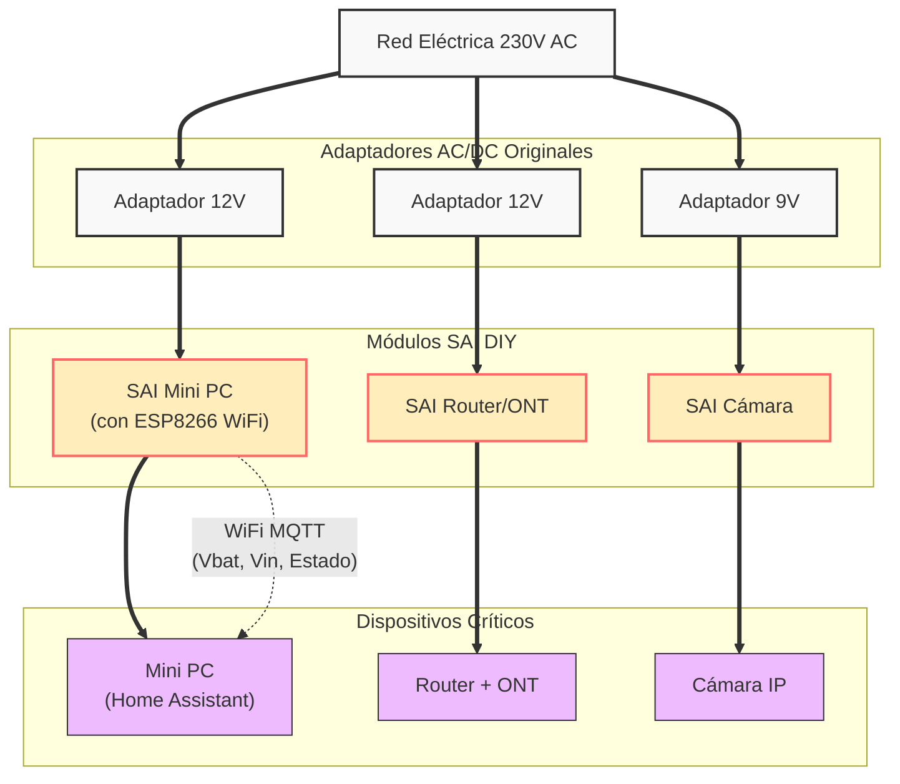
```mermaid
graph TD
    %% Nodos de Energía
    AC[Red Eléctrica 230V AC]
    
    subgraph Fuentes [Adaptadores AC/DC Originales]
        ADP_PC[Adaptador 12V]
        ADP_Router[Adaptador 12V]
        ADP_Cam[Adaptador 9V]
    end

    subgraph SAI [Módulos SAI DIY]
        SAI_PC["SAI Mini PC<br/>(con ESP8266 WiFi)"]
        SAI_Router[SAI Router/ONT]
        SAI_Cam[SAI Cámara]
    end

    subgraph Dispositivos [Dispositivos Críticos]
        HA["Mini PC<br/>(Home Assistant)"]
        RUT[Router + ONT]
        CAM[Cámara IP]
    end

    %% Flujo de Potencia
    AC ==> ADP_PC
    AC ==> ADP_Router
    AC ==> ADP_Cam

    ADP_PC ==> SAI_PC ==> HA
    ADP_Router ==> SAI_Router ==> RUT
    ADP_Cam ==> SAI_Cam ==> CAM

    %% Flujo de Datos
    SAI_PC -.->|"WiFi MQTT<br/>(Vbat, Vin, Estado)"| HA


    %% Estilos
    classDef power fill:#f9f9f9,stroke:#333,stroke-width:2px;
    classDef ups fill:#ffeebb,stroke:#f66,stroke-width:2px;
    classDef device fill:#eebbff,stroke:#333,stroke-width:1px;
    
    class AC,ADP_PC,ADP_Router,ADP_Cam power;
    class SAI_PC,SAI_Router,SAI_Cam ups;
    class HA,RUT,CAM device;
```

#### Descripción del Flujo
1.  **Alimentación:** Cada dispositivo utiliza su adaptador original. El SAI se intercala entre el adaptador y el dispositivo.
2.  **Monitorización:** El SAI del Mini PC (que consume más y es crítico) incluye un módulo WiFi que envía telemetría (voltaje de batería, presencia de red) vía MQTT.
3.  **Integración:** El Router gestiona la red local, permitiendo que el mensaje MQTT del SAI llegue al servidor Home Assistant (alojado en el Mini PC), cerrando el bucle de monitorización.


---

## 3. Diseño y Desarrollo Hardware

### 3.1 Selección del Controlador Principal

Se evaluaron varias opciones de módulos SAI comerciales. A continuación se muestran las placas analizadas:

| Opción |                  Imagen                   | Características                              |  Potencia Salida   | Decisión                                     |
| :----: | :---------------------------------------: | :------------------------------------------- | :----------------: | :------------------------------------------- |
| **1**  | 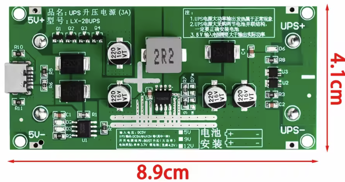 | **LX-2BSAI (Verde)**. Entrada USB-C 5V. 1S.  |        ~15W        | Descartada (Poca potencia/5V in).            |
| **2**  | 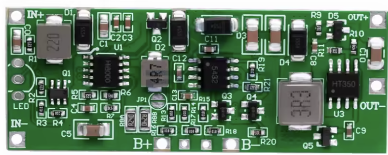 | **3S Lithium SAI**. 12V. Baterías 3S.        |        ~30W        | Descartada (Requiere 3 celdas, caja grande). |
| **3**  | 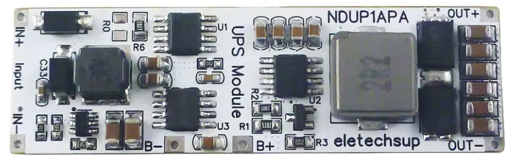 | **NDUP1APA (Blanca)**. Salida 9V. 1S.        |        ~15W        | **Seleccionada** para Cámara (9V).           |
| **4**  | 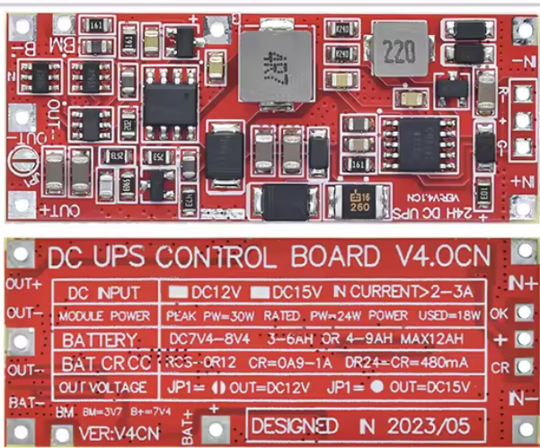 | **DC SAI V4.0CN (Roja)**. Entrada 5-12V. 2S. | **24W (35W Pico)** | **Seleccionada** para Router y Mini PCs.     |

**Selección Final:**
Se estandarizó el uso de la **Opción 4 (Placa Roja)** para la mayoría de dispositivos debido a su capacidad de potencia (24W-35W) y flexibilidad de voltaje de entrada.

### 3.2 Arquitectura Interna del Controlador (V4.0CN)

El módulo seleccionado integra la gestión de carga, protección y regulación de salida en una sola placa. El siguiente diagrama detalla su funcionamiento interno y conexiones:

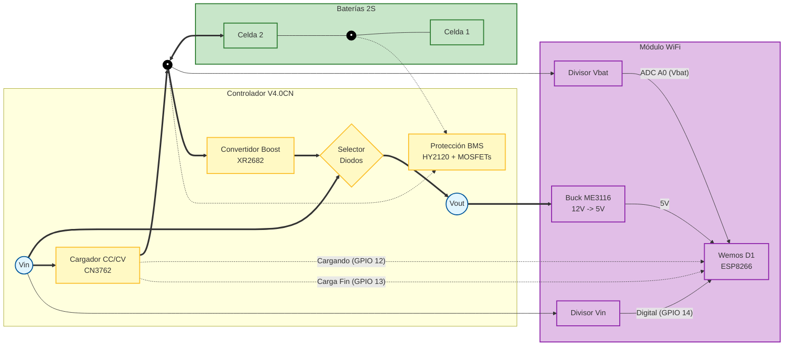
```mermaid
graph LR


    %% Bloque Principal Controlador
    subgraph PCB [Controlador V4.0CN]
        direction TB
        
        %% Puertos de Potencia
        IN((Vin))
        OUT((Vout))
        
        %% Componentes Principales
        CHG[Cargador CC/CV<br/>CN3762]
        PROT[Protección BMS<br/>HY2120 + MOSFETs]
        BST[Convertidor Boost<br/>XR2682]
        SW{Selector<br/>Diodos}
        

        
        %% Ruta de Potencia Interna

        IN ==> SW
        IN ==> CHG
        BST ==> SW
        SW ==> OUT
    end
    
    %% Pack de Baterías con Punto Medio
    subgraph BATT [Baterías 2S]
        direction TB
        C2[Celda 2] --- MP((•)) --- C1[Celda 1]
    end

    %% Módulo WiFi Externo
    subgraph WIFI [Módulo WiFi]
        DC[Buck ME3116<br/>12V -> 5V]
        DIV_IN[Divisor Vin]
        DIV_BAT[Divisor Vbat]
        MCU[Wemos D1<br/>ESP8266]
        
        DC -->|5V| MCU
        DIV_IN -->|"Digital (GPIO 14)"| MCU
        DIV_BAT -->|"ADC A0 (Vbat)"| MCU
    end

    %% Junturas Externas
    J_Bat((•))

    %% Conexiones de Potencia Globales
    CHG ==> J_Bat
    J_Bat <==> C2
    J_Bat ==> BST
    
    %% Monitorización BMS (Puntos de conexión)
    J_Bat -.-> PROT
    MP -.-> PROT

    
    %% Conexiones de Señal / WiFi

    OUT ==> DC
    
    IN --> DIV_IN
    J_Bat --> DIV_BAT
    
    CHG -.->|"Cargando (GPIO 12)"| MCU
    CHG -.->|"Carga Fin (GPIO 13)"| MCU

    %% Estilos
    classDef pcb fill:#fff9c4,stroke:#fbc02d,stroke-width:2px;
    classDef ext fill:#e1f5fe,stroke:#01579b,stroke-width:2px;
    classDef bat fill:#c8e6c9,stroke:#2e7d32,stroke-width:2px;
    classDef wifi fill:#e1bee7,stroke:#8e24aa,stroke-width:2px;
    classDef junc fill:#000,stroke:#000,stroke-width:1px,color:#fff;

    class CHG,PROT,BST,SW pcb;
    class ADP,IN,OUT ext;
    class C1,C2,MP,BATT bat;
    class DC,MCU,DIV_IN,DIV_BAT,WIFI wifi;
    class J_IN,J_Bat,MP junc;
```

### 3.3 Bloque Controlador (V4.0CN)

El núcleo del sistema es la placa **DC SAI V4.0CN**, que integra los subsistemas de potencia.

<div align="center">
  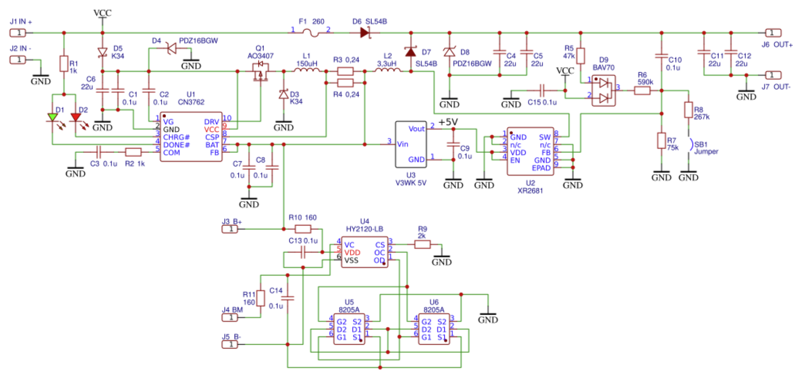
  <p><i>Figura 1: Esquema electrónico completo del módulo DC SAI V4.0CN.</i></p>
</div>

El chip **[CN3762](anexos/Datasheet%20CN3762.PDF)** gestiona la carga de las baterías 2S (8.4V) desde la entrada de 12V. Utiliza un perfil de carga CC/CV.

<div align="center">
  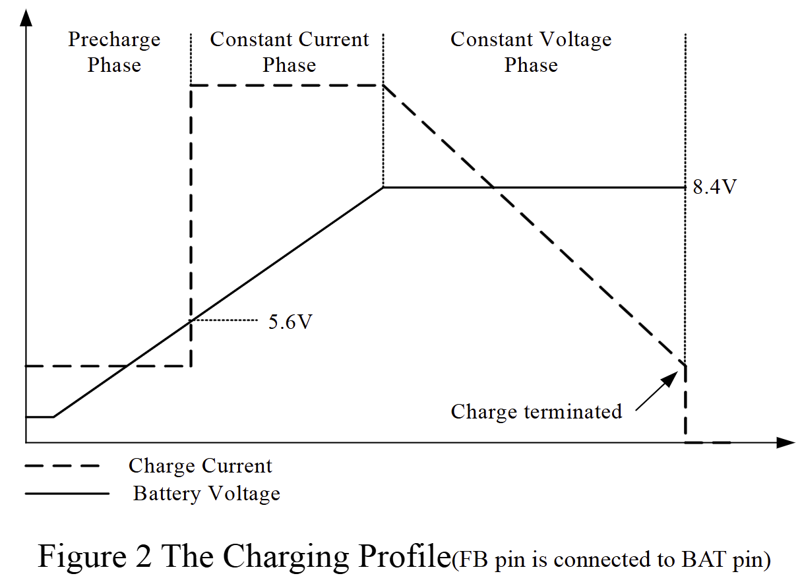
  <p><i>Figura 2: Perfil de carga típico (Pre-charge -> CC -> CV) del datasheet del CN3762.</i></p>
</div>

<div align="center">
  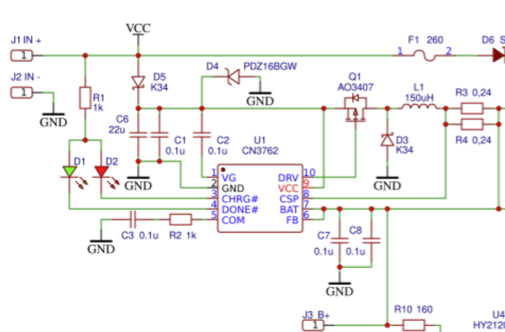
  <p><i>Figura 3: Detalle del circuito de carga en la placa V4.0CN.</i></p>
</div>

El sistema de protección monitorea el voltaje de cada celda individualmente y el punto medio para prevenir situaciones peligrosas, basado en el **[HY2120](anexos/Datasheet%20BMS%20HY2120.pdf)** y MOSFETs **[FS8205A](anexos/Datasheet%20mosfet%208205A.PDF)**.

<div align="center">
  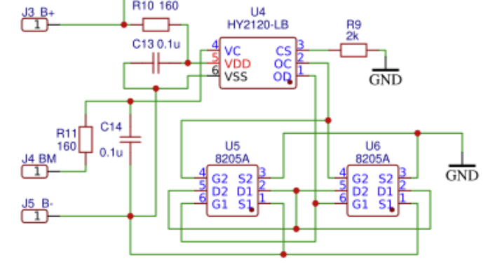
  <p><i>Figura 4: Circuito de protección con chip HY2120 y MOSFETs duales 8205A.</i></p>
</div>

**Puntos de control (según datasheet):**
- Sobrecarga: 4.28V
- Sobredescarga: 2.90V


#### 3.3.3 Convertidor Boost (XR2682)

Este subsistema eleva el voltaje proveniente de la batería (6.0V - 8.4V) a una tensión de salida regulada (originalmente 12.2V, ajustada a **~11.35V** tras la mejora en R7) mediante el **[XR2682](anexos/Datasheet%20DCDC%20XR2682.pdf)**.

<div align="center">
  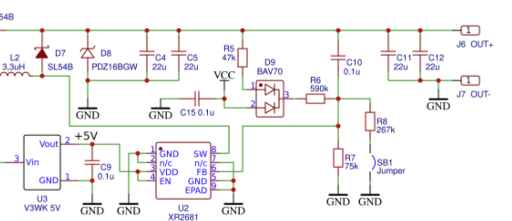
  <p><i>Figura 5: Detalle del circuito Boost basado en XR2681/XR2682.</i></p>
</div>

<div align="center">
  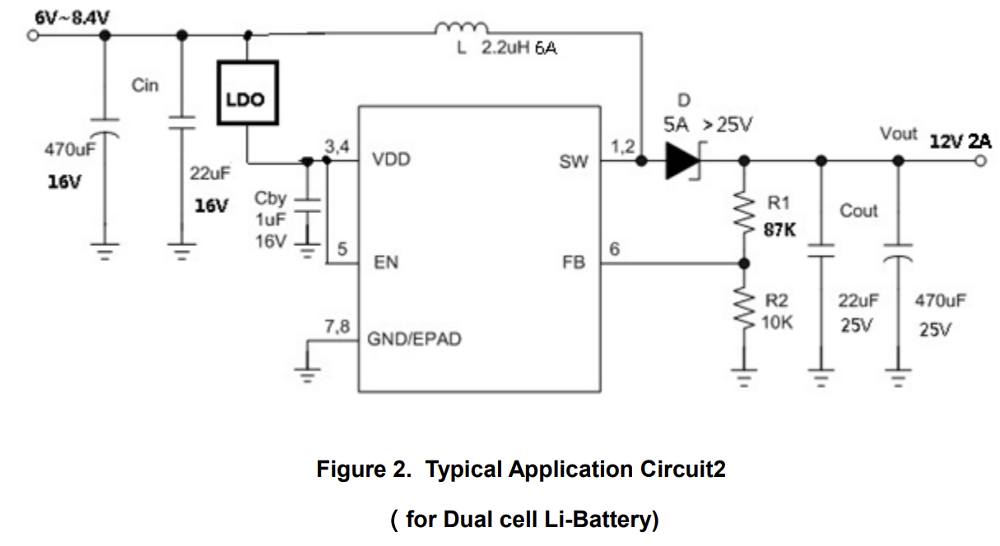
  <p><i>Figura 6: Circuito de aplicación típico recomendado por el fabricante.</i></p>
</div>

#### 3.3.4 Modificaciones del Circuito (Boost Fix)

Durante las pruebas de validación, se identificó un problema crítico de diseño relacionado con la transición entre la alimentación externa (adaptador) y la batería.

**Problema:**
Con adaptadores que entregan un voltaje bajo bajo carga (pueden caer a ~11V - 11.5V), el convertidor Boost **U2 (XR2681/2)** no se desactivaba correctamente. El mecanismo de apagado depende de que el voltaje de entrada (VCC), a través del diodo **D9_2**, eleve el voltaje en el nodo de feedback (pin FB) por encima de su umbral de regulación (~1.25V - 1.27V). Si VCC es bajo, este umbral no se alcanza, provocando que U2 siga activo drenando la batería incluso con red eléctrica presente, lo que a su vez impide que el cargador **U1 (CN3762)** funcione correctamente.

**Modificaciones Implementadas:**

1.  **Ajuste del Divisor de Feedback (R7):**
    *   **Acción:** Se reemplazó la resistencia **R7** (conectada entre el pin FB y GND) de 75kΩ por una de **82kΩ**.
    *   **Efecto:** Al aumentar R7, se facilita que el voltaje inyectado desde VCC supere el umbral de desactivación del Boost.
    *   **Resultado:** Con esta modificación, incluso con adaptadores de ~11V, el pin FB mide ~1.28V, asegurando que el Boost se apague por completo. Como efecto secundario, la tensión de salida ($V_{out}$) en modo batería se reduce ligeramente de 12.25V a **11.35V**.

2.  **Reducción de Corriente de Carga (R4):**
    *   **Acción:** Se eliminó la resistencia **R4** (0.24Ω), que estaba en paralelo con **R3**.
    *   **Efecto:** La resistencia de sensado de corriente para el cargador U1 aumentó a 0.24Ω.
    *   **Resultado:** La corriente máxima de carga de la batería bajó de **~1A a ~0.5A**. Esto reduce la carga sobre los adaptadores de entrada "débiles", ayudando a que VCC se mantenga lo más alto posible y facilitando la desactivación del Boost descrita anteriormente.

**Comportamiento Final del Sistema:**

-   **Modo Cargador:** La carga se alimenta directamente desde la entrada vía diodo D6. $V_{out}$ depende del adaptador (~10.6V - 11V). El cargador U1 recarga la batería a un máximo de 0.5A.
-   **Modo Batería:** El Boost U2 se activa y regula la salida a **~11.35V** estables.
-   **Consideración:** Los dispositivos conectados deben soportar este rango de tensión (~10.6V a 11.4V), lo cual es estándar para la mayoría de equipos de "12V".

---

### 3.4 Bloque de Baterías 2S

Para determinar la mejor solución de almacenamiento, se evaluaron diversas celdas 18650 del mercado:

| Característica | Modelo 1  | Modelo 2  | Modelo 3  | Modelo 4 | Modelo 5  |                                 Modelo 6                                  | Modelo 7  |
| :------------- | :-------: | :-------: | :-------: | :------: | :-------: | :-----------------------------------------------------------------------: | :-------: |
| **Marca**      | LiitoKala | LiitoKala | LiitoKala |  DMEGC   | LiitoKala |                                  Samsung                                  | LiitoKala |
| **Tipo**       |    HG2    | NCR18650B |  LII-34B  | INR18650 |  Lii-35A  | **[Samsung INR18650-35E](anexos/Datasheet%20Samsung%20INR18650-35e.pdf)** | NCR18650B |
| **Capacidad**  |  3000mAh  |  3400mAh  |  3400mAh  | 2600mAh  |  3500mAh  |                                  3400mAh                                  |  3400mAh  |
| **Ciclos**     |   1000    |    500    |   1000    |    -     |    500    |                                    500                                    |   1000    |
| **Descarga**   |    20A    |    5A?    |     -     |   7,8A   |    10A    |                                    8A                                     |    5A?    |
| **Precio ud*** |   5,07€   |   3,14€   |   6,89€   |  2,99€   |   3,44€   |                                   2,64€                                   |   2,80€   |

*\*Nota: Precio unitario basado en compra de pack de 10 unidades.*

**Selección Final:**
*   **Modelo 6 ([Samsung INR18650-35E](anexos/Datasheet%20Samsung%20INR18650-35e.pdf)):** Elegida por su alta calidad, excelente equilibrio entre capacidad real (3400mAh), capacidad de descarga (8A continuo), fiabilidad de marca y precio competitivo.

#### Especificaciones Técnicas ([Samsung INR18650-35E](anexos/Datasheet%20Samsung%20INR18650-35e.pdf))

La celda **[Samsung INR18650-35E](anexos/Datasheet%20Samsung%20INR18650-35e.pdf)** tiene las siguientes características técnicas:

| Parámetro                | Valor / Detalle                          | Comentario                             |
| :----------------------- | :--------------------------------------- | :------------------------------------- |
| **Método de carga**      | CC-CV                                    | Voltaje constante / Corriente limitada |
| **Carga Estándar**       | 1.7A (0.5C) a 4.2V                       | Tensión máxima de 4.2V                 |
| **Corriente de corte**   | 68mA (0.02C)                             | Fin de carga                           |
| **Corriente máx. carga** | 2.0A                                     | Carga rápida                           |
| **Tiempo de carga**      | 4h                                       | Tiempo típico                          |
| **Capacidad descarga**   | 3.35Ah                                   | Estándar                               |
| **Corriente descarga**   | 8A (Cont.) / 13A (Pico)                  | Alta descarga                          |
| **Límite de descarga**   | 2.65V                                    | Voltaje de corte (Cut-off)             |
| **Voltaje nominal**      | 3.6V                                     | -                                      |
| **Temperaturas**         | 0 - 45ºC (Carga) / -10 - 60ºC (Descarga) | -                                      |
| **Ciclos de vida**       | 500                                      | Capacidad >60% de la estándar          |

<div align="center">
  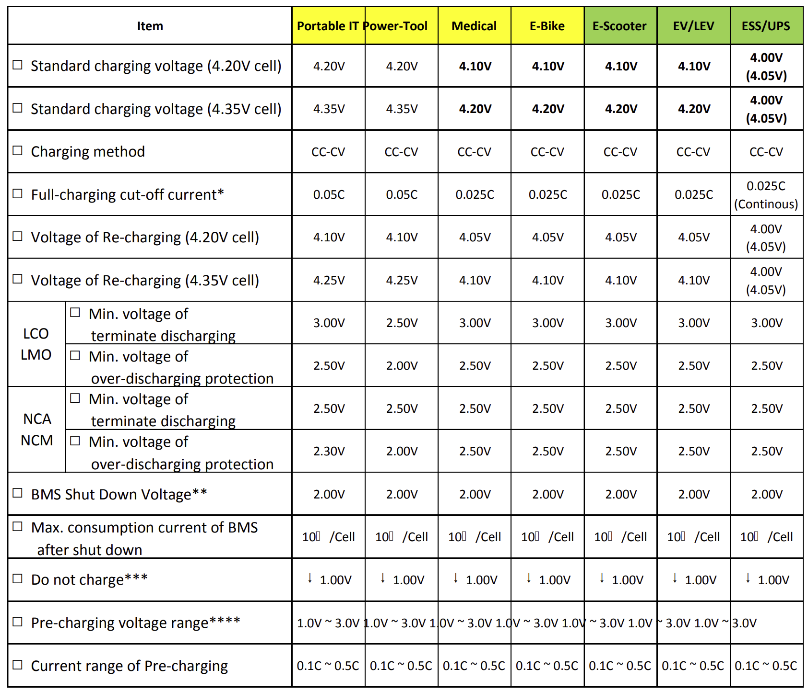
  <p><i>Figura 7: Tabla de especificaciones de configuración del BMS para distintos modos de operación.</i></p>
</div>

**Análisis de la Configuración:**
La tabla superior muestra los voltajes de corte recomendados según la aplicación. Para sistemas **ESS/UPS** (como este proyecto), se recomienda una tensión de carga de **4.00V** para maximizar la vida útil de las celdas Li-ion. 

Sin embargo, el chip **HY2120** montado en esta placa tiene un umbral de sobrecarga fijado en **4.28V** (estándar de consumo). Esto significa que, aunque la placa funciona correctamente como SAI, las baterías estarán sometidas a un voltaje de flotación superior al ideal para almacenamiento a largo plazo. 

**Configuración del Pack:**
- **Esquema:** 2S (2 celdas en serie).
- **Voltaje Nominal:** 7.2V.
- **Voltaje Pico:** 8.4V.

---

### 3.5 Bloque Módulo WiFi y Señales

Para la versión monitorizada, se utiliza un módulo externo basado en ESP8266 (Wemos D1 Mini) que interacciona con el controlador.

Dado que el SAI entrega 12V y el ESP8266 requiere 5V, se integra una placa adaptadora con un convertidor Buck **[ME3116](anexos/Datasheet%20DCDC%20ME3116_E3.0.pdf)**.

<div align="center">
  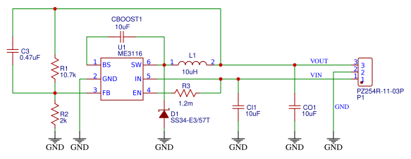
  <p><i>Figura 8: Esquema del convertidor DC-DC diseñado para alimentar el módulo WiFi.</i></p>
</div>

<div align="center">
  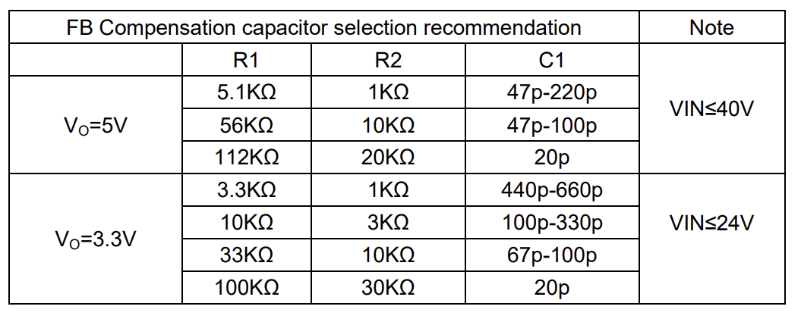
  <p><i>Figura 9: Tabla de selección de componentes para compensación (Datasheet ME3116).</i></p>
</div>

#### 3.5.2 Interfaz de Señales (Monitorización)

El ESP8266 monitoriza el estado del SAI a través de varias líneas de señal, acondicionadas mediante divisores resistivos para proteger las entradas de 3.3V (especialmente la analógica).

| Señal          | Origen           | Conexión ESP8266 | Acondicionamiento | Función                                   |
| :------------- | :--------------- | :--------------- | :---------------- | :---------------------------------------- |
| **Vin Sense**  | Entrada 12V (IN) | **GPIO 14** (D5) | **Divisor Vin**   | Detecta presencia de red eléctrica.       |
| **Vbat Sense** | Batería (J_Bat)  | **ADC A0**       | **Divisor Vbat**  | Lectura analógica del voltaje de batería. |
| **Charging**   | Chip CN3762      | **GPIO 12** (D6) | Directo (*)       | Señal digital de estado "Cargando".       |
| **Done**       | Chip CN3762      | **GPIO 13** (D7) | Directo (*)       | Señal digital de "Carga Completa".        |

*\*Nota: Las señales del CN3762 son de colector abierto (Open Drain), activas a nivel bajo.*

##### 3.5.2.1 Monitorización de Voltaje de Entrada (Vin)

Se utiliza un divisor resistivo para detectar la presencia o ausencia de alimentación externa. Esta señal se conecta a un pin digital para actuar como un sensor de estado binario.

*   **Valores Escogidos:**
    *   **R1:** 10 kΩ (Ya presente en el circuito original).
    *   **R2:** 3.3 kΩ (Añadida entre la señal y masa).
*   **Cálculos:**
    *   Para un $V_{in}$ máximo de 15V: $I_d \approx 0.90\text{ mA} < 1\text{ mA}$, lo cual garantiza un consumo despreciable y protección del pin.
*   **Conexión:** GPIO 14 (D5).

##### 3.5.2.2 Monitorización de Voltaje de Batería (Vbat)

Para medir la tensión real del pack de baterías 2S (máximo ~8.4V), se utiliza un divisor resistivo conectado al pin analógico del ESP8266.

*   **Valores Escogidos:**
    *   **R1:** 33 kΩ.
    *   **R2:** 20 kΩ.
*   **Cálculos:**
    *   Corriente de rama: $I_d \approx 0.17\text{ mA}$.
    *   Rango de lectura: Configurado en Tasmota para mapear el voltaje a un rango de 0-9900mV, permitiendo una calibración precisa con multímetro.
*   **Conexión:** ADC A0.

#### 3.5.3 Microcontrolador (Wemos D1 Mini)

<div align="center">
  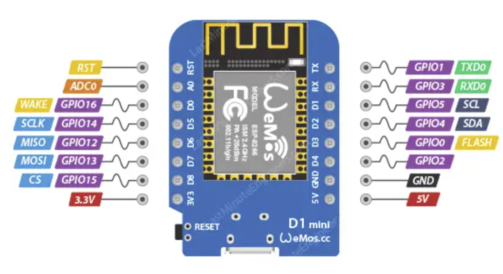
  <p><i>Figura 10: Mapa de pines del Wemos D1 Mini y sus conexiones.</i></p>
</div>

---

#### 3.6.1 Cajas y Modelos Finalizados

Se utilizaron diferentes cajas según el tamaño de la batería y la electrónica extra (WiFi).

|   Modelo   |   Caja   |                                        Imagen                                        |
| :--------: | :------: | :----------------------------------------------------------------------------------: |
| **Cámara** | Opción 2 |    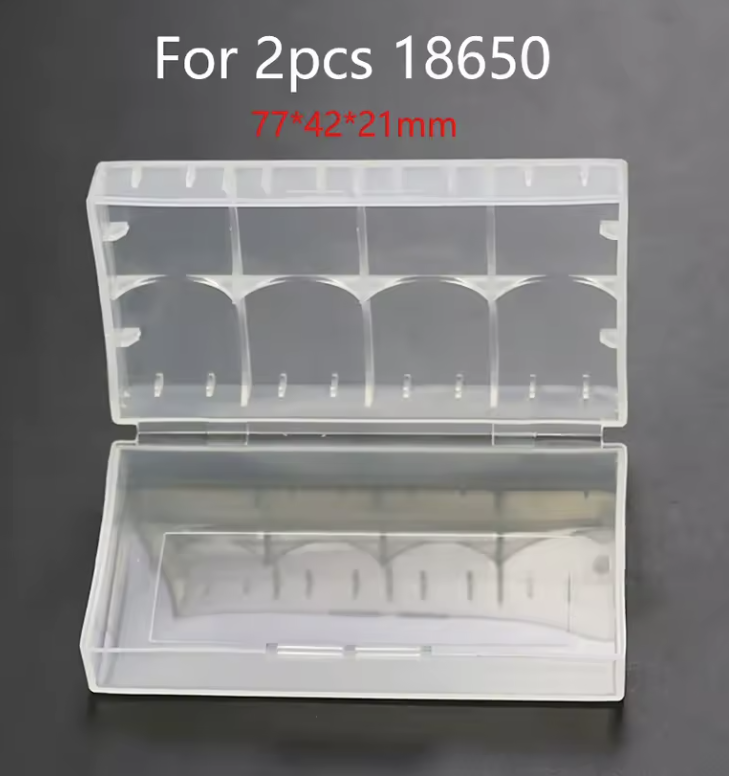<br><i>Caja transparente pequeña.</i>    |
| **Router** | Opción 1 |       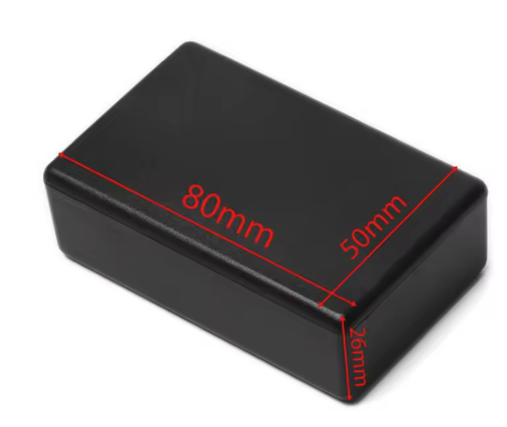<br><i>Caja estándar negra.</i>       |
|  **WiFi**  | Opción 3 | 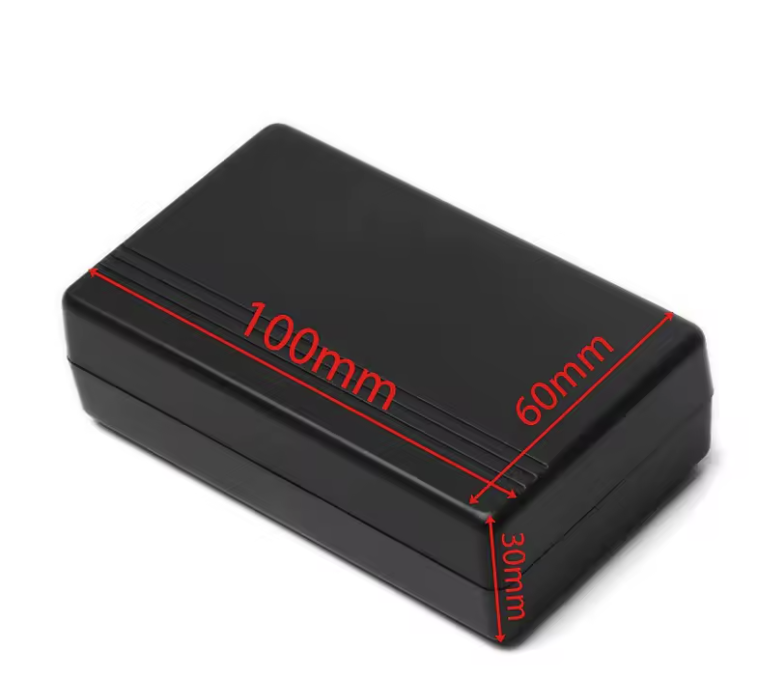<br><i>Caja grande para alojar ESP8266.</i> |

A continuación se muestran los resultados finales del ensamblaje para las distintas versiones:

| Versión                         |                                              Imagen del Ensamblaje                                              |
| :------------------------------ | :-------------------------------------------------------------------------------------------------------------: |
| **Router / Mini-PC (Sin WiFi)** | 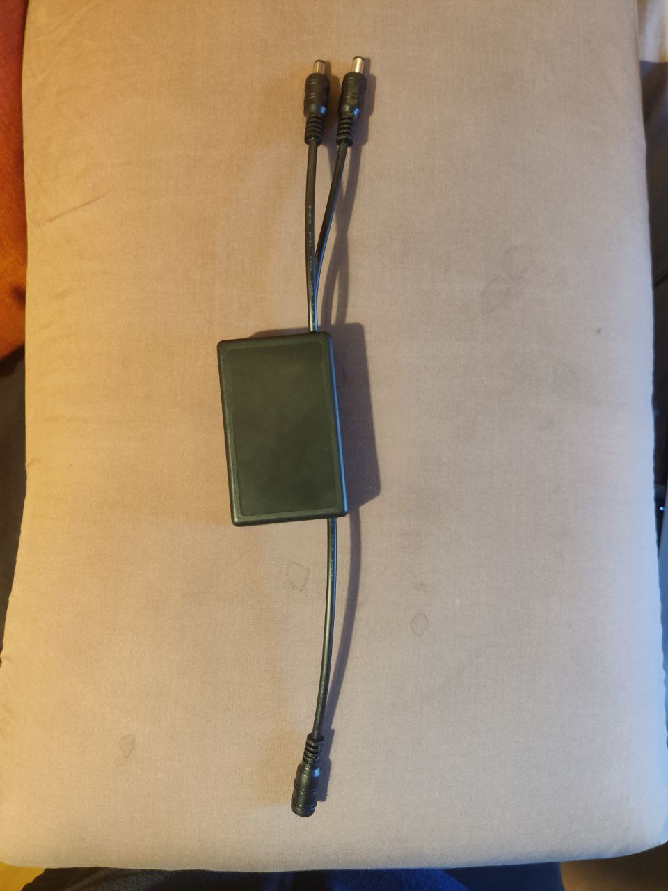<br><i>Figura 11: Modelo básico terminado en caja negra estándar.</i> |
| **Cámara TAPO C210**            |        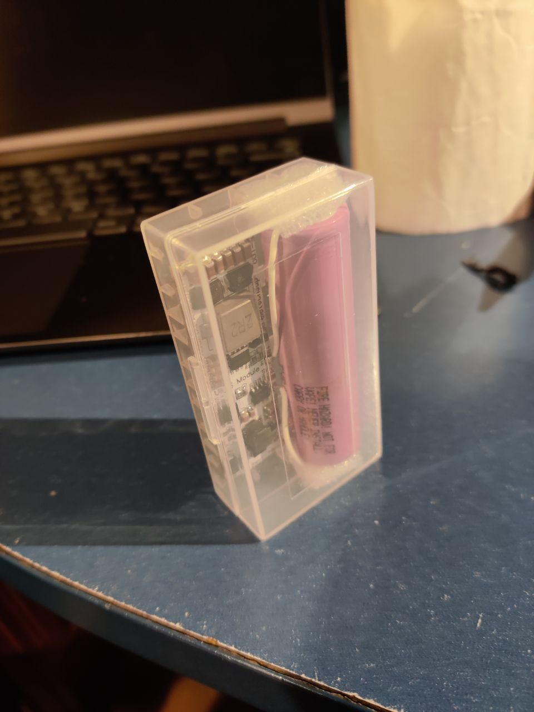<br><i>Figura 12: Versión compacta de 9V terminada.</i>        |
| **Router / Mini-PC (Con WiFi)** | 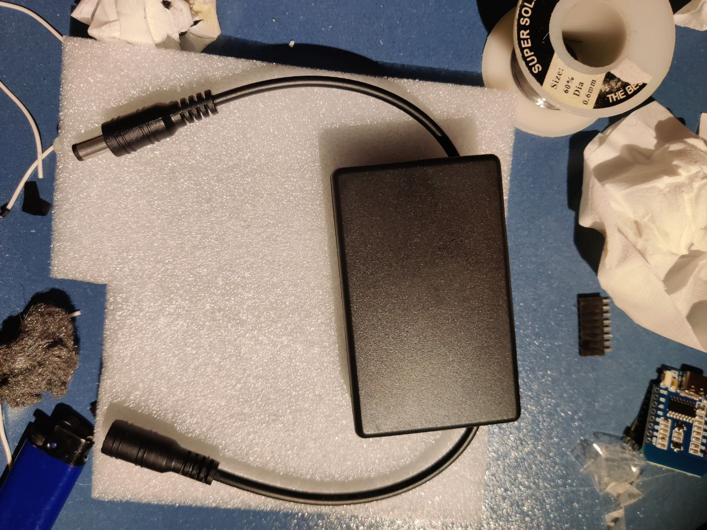<br><i>Figura 13: Versión monitorizada terminada en caja grande.</i>  |

<div align="center">
  
  <p><i>Figura 14: Esquema de montaje, posicionamiento y volúmenes del ensamblaje.</i></p>
</div>

<div align="center">
  
  <p><i>Figura 15: Detalle del montaje del ESP8266 y cableado interno (Vista real sin tapa).</i></p>
</div>

#### 3.6.2 Definición de Modelos SAI

Basado en los requisitos específicos de cada dispositivo, se estandarizaron tres diseños:

| Modelo       | Objetivo               | Controladora | Celda  | Config. |     WiFi     |     Caja      | Cantidad |
| :----------- | :--------------------- | :----------: | :----: | :-----: | :----------: | :-----------: | :------: |
| **Diseño 1** | Dispositivo 3 (Cámara) |   Opción 3   | Mod. 6 |  1S1P   |      No      |     Opt 2     |    1     |
| **Diseño 2** | Dispositivo 2 y 4      |   Opción 4   | Mod. 6 |  2S1P   |      No      |     Opt 1     |    2     |
| **Diseño 3** | Dispositivo 1 y 5      |   Opción 4   | Mod. 6 |  2S1P   | Sí (ESP8266) | Opt 1 / Opt 3 |    2     |

#### 3.6.3 Análisis de Costes y Materiales (BOM)

| Concepto               | Cantidad | Precio Unit. | Envío |   Total    |
| :--------------------- | :------: | :----------: | :---: | :--------: |
| **Celdas 18650**       |    12    |    2,15€     | 4,87€ |   30,67€   |
| **D1 Mini ESP8266**    |    3     |    1,39€     |   -   |   4,17€    |
| **Conversor Buck 5V**  |    3     |    0,89€     |   -   |   2,67€    |
| **Caja (Opt 1)**       |    4     |    1,29€     |   -   |   5,16€    |
| **Caja (Opt 2)**       |    1     |    1,60€     |   -   |   1,60€    |
| **Caja (Opt 3)**       |    2     |    1,91€     |   -   |   3,82€    |
| **Jacks 5.5x2.1mm**    | 10 pares |    0,419€    |   -   |   4,19€    |
| **BMS SAI (Modelo 4)** |    5     |    1,99€     | 1,75€ |   11,70€   |
| **BMS SAI (Modelo 3)** |    1     |    4,29€     | 1,99€ |   5,09€*   |
| **Descuentos/Cupones** |    -     |      -       |   -   |   -3,00€   |
| **TOTAL**              |          |              |       | **66,07€** |
*\*Nota: Ajuste de precio aplicado por el vendedor.*

**Coste Estimado por Diseño:**
- **Diseño 1 (Cámara):** 9,26€ (Aprox. **10€**)
- **Diseño 2 (Básico):** 8,00€ (Aprox. **9€**)
- **Diseño 3 (WiFi):** 10,28€ (Aprox. **12€**)

**Tiempo de Fabricación:**
- Se estima un tiempo de **2 horas de montaje** mínimo por unidad (caja).

### 3.7 Estimaciones de Autonomía y Rendimiento

Se realizaron estimaciones de autonomía y carga de descarga para cada escenario operativo:

|   #   | Dispositivo    | Config. Bat. | Capacidad (Wh)* | Tiempo UPS Estimado | Descarga Máx. por Celda (A) |
| :---: | :------------- | :----------: | :-------------: | :-----------------: | :-------------------------: |
|   1   | Mini PC (BMAX) |     2S1P     |     ~25 Wh      |      2h 20min       |            3.3A             |
|   2   | Router TC7230  |     2S1P     |     ~25 Wh      |      1h 40min       |            4.2A             |
|   3   | Cámara Tapo    |     1S1P     |     ~12 Wh      |      2h 20min       |            1.5A             |
|   4   | Zyxel + ONT    |     2S1P     |     ~25 Wh      |       1h - 2h       |            3.3A             |
|   5   | Mini PC (ACE)  |     2S1P     |     ~25 Wh      | 1h 15min - 2h 30min |            4.2A             |

*\*Nota: Capacidad calculada aproximadamente como $NumCeldas \times 3.6V \times 3.4Ah$. El tiempo UPS estimado se deriva de la formula $Capacidad / Consumo$.*

---

## 4. Configuración e Integración en Home Assistant

### 4.1 Configuración de Tasmota

#### 4.1.1 Configuración de Tasmota (Generic 18)

1. **Tipo de Módulo:** Generic (18).
2. **Asignación de GPIOs:**

| Label  |  GPIO  | Asignación | Tasmota Función |  ID   | Comentario  |
| :----: | :----: | :--------- | :-------------- | :---: | :---------- |
| **D0** | GPIO16 | -          | -               |   -   | -           |
| **D1** | GPIO5  | -          | -               |   -   | -           |
| **D2** | GPIO4  | -          | -               |   -   | -           |
| **D3** | GPIO0  | -          | -               |   -   | -           |
| **D4** | GPIO2  | -          | -               |   -   | -           |
| **D5** | GPIO14 | Vin status | switch_n        |   1   | flotante    |
| **D6** | GPIO12 | Charging   | switch          |   2   | Con pull-up |
| **D7** | GPIO13 | Done       | Switch          |   3   | Con pull-up |
| **D8** | GPIO15 | -          | -               |   -   | -           |
| **RX** | GPIO3  | -          | -               |   -   | -           |
| **TX** | GPIO1  | -          | -               |   -   | -           |
| **A0** |  ADC0  | V_BAT      | ADC Range       |   -   | En mV       |

#### 4.1.3 Comandos de Consola

Ejecutar en la consola web de Tasmota para configurar el comportamiento de los sensores y la calibración:

*   **SetOption114 1:** Desacopla el estado de POWER de los switches (configura los pines como sensores de entrada puros).
*   **SwitchMode1 1:** Configura Switch1 (Vin) como ON=1 (Presente), OFF=0 (Ausente).
*   **SwitchMode2 2:** Configura Switch2 (Charging) como invertido: ON=0 (Cargando), OFF=1 (No cargando).
*   **SwitchMode3 2:** Configura Switch3 (Done) como invertido: ON=0 (Cargada), OFF=1 (No cargada).
*   **AdcParam 6, 0, 1023, 0, 9900:** Configura el ADC (A0) para mapear el rango 0-1023 a 0-9900mV (se recomienda ajustar el último valor mediante una regla de tres tras medir con polímetro).
*   **SaveData 1:** Asegura que la configuración se guarde de forma permanente.
*   **Restart 1:** Reinicia el módulo para aplicar todos los cambios.

```bash
# Secuencia de comandos completa para consola
SetOption114 1
SwitchMode1 1
SwitchMode2 2
SwitchMode3 2
AdcParam 6, 0, 1023, 0, 9900
SaveData 1
Restart 1
```

#### 4.1.4 Reglas MQTT

Para publicar los estados de los sensores binarios (Vin, Carga, Fin) de forma inmediata vía MQTT, se debe introducir la siguiente regla en la consola:

```tasmota
Rule1 
  ON switch1#state DO publish stat/%topic%/VIN %value% ENDON 
  ON switch2#state DO publish stat/%topic%/Charging %value% ENDON 
  ON switch3#state DO publish stat/%topic%/Done %value% ENDON
```

Para activar la regla, se debe ejecutar:
```tasmota
Rule1 1
```

*Nota: Esta configuración asegura que los cambios de estado se notifiquen al instante sin esperar al intervalo de telemetría (TelePeriod).*

### 4.3 Integración en Home Assistant

La monitorización se basa en la combinación de la integración nativa de Tasmota y la definición manual de sensores específicos para el tratamiento de datos analógicos.

#### 4.3.1 Configuración YAML (Sensores y Plantillas)

Añadir al archivo `configuration.yaml` los siguientes bloques para procesar el voltaje bruto del ADC. Esto permite tener una lectura calibrada y legible.

```yaml
mqtt:
  sensor:
    - name: "UPS Battery Voltage RAW"
      state_topic: "tele/UPS_405CDE/SENSOR"
      value_template: "{{ value_json.ANALOG.A0 }}"
      unit_of_measurement: "raw"
      unique_id: ups_405cde_analog_a0_raw

# --- Sensor Plantilla para convertir ADC raw a Voltaje Real ---
template:
  - sensor:
      - name: "UPS Battery Voltage"
        state: >
          
          {# Ajuste de fórmula según divisor resistivo (33k/20k) y resolución #}
           
          {{ voltage | round(2) }} 
        unit_of_measurement: "V"
        device_class: voltage
        state_class: measurement 
        unique_id: ups_405cde_battery_voltage_calculated
```

#### 4.3.2 Integración Nativa de Tasmota

El resto de entidades (estados de carga, presencia de red, etc.) se descubren automáticamente mediante la integración de Tasmota en Home Assistant, facilitando la gestión individual de cada sensor sin configuración manual adicional.

<div align="center">
  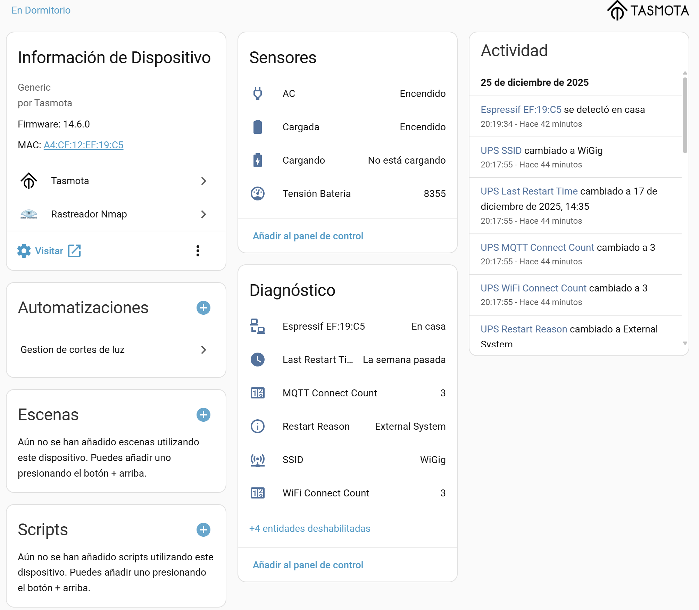
  <p><i>Figura 16: Vista del panel de control del dispositivo SAI en Home Assistant mediante la integración de Tasmota.</i></p>
</div>

#### 4.3.3 Automatizaciones de Ejemplo

**Notificación de corte de luz:**

```yaml
automation:
  - alias: "Notificar corte de luz"
    trigger:
      - platform: state
        entity_id: binary_sensor.ups_405cde_vin_status
        to: "off"
    action:
      - service: notify.mobile_app
        data:
          title: "⚠️ Corte de luz detectado"
          message: "El SAI ha entrado en modo batería."
```

### 4.4 Estados Lógicos de Monitorización

| Modo         |  Vin  | Charging | Done  | Topic/Mode |
| :----------- | :---: | :------: | :---: | :--------- |
| **Batería**  |  OFF  |    X     |   X   | Bateria    |
| **Cargando** |  ON   |    ON    |   X   | Cargando   |
| **Cargado**  |  ON   |    X     |  ON   | Cargada    |

---

## 5. Pruebas y Rendimiento

Se verificó el comportamiento térmico bajo carga máxima (descarga de batería alimentando Mini PC).

<div align="center">
  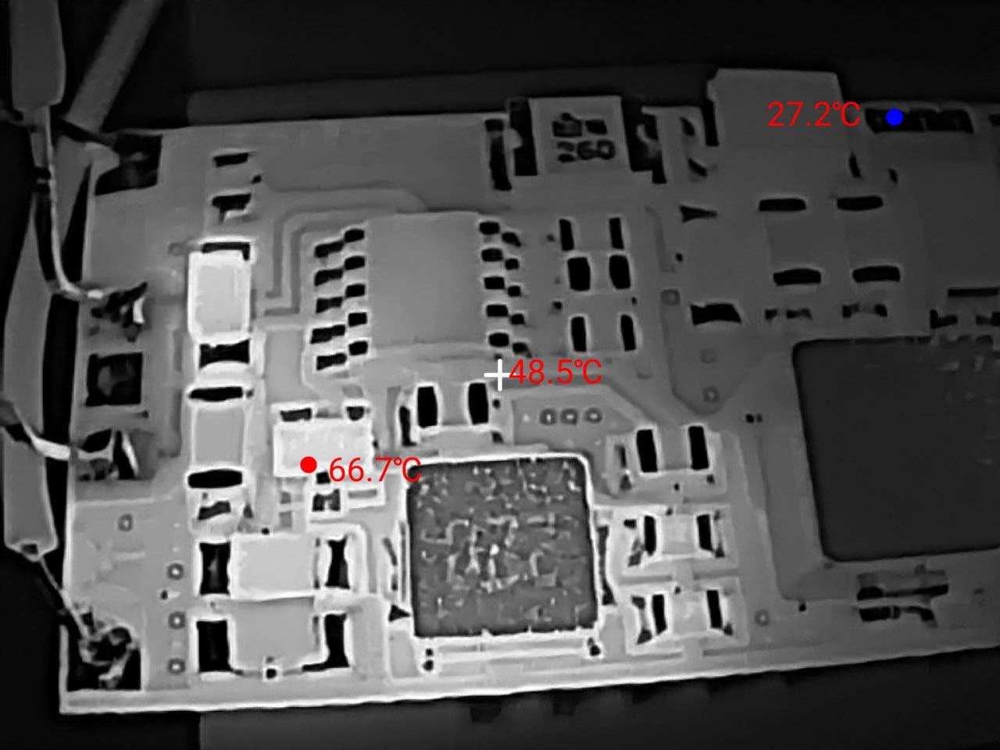
  <p><i>Figura 17: Imagen térmica mostrando el calentamiento del IC Boost (punto caliente).</i></p>
</div>

<div align="center">
  
  <p><i>Figura 18: Vista térmica general del montaje durante la prueba de 2 horas (Visible + Térmica).</i></p>
</div>

**Resultados:** Temperaturas dentro de rangos seguros (<60°C en componentes de potencia).

---

### 6.1 Datasheets de Componentes


*   **Batería:** [Samsung INR18650-35E](anexos/Datasheet%20Samsung%20INR18650-35e.pdf)
*   **Gestión de Energía:**
    *   [CN3762](anexos/Datasheet%20CN3762.PDF) - Controlador de carga de baterías Li-Ion (2S).
    *   [HY2120](anexos/Datasheet%20BMS%20HY2120.pdf) - Protección de batería (BMS).
    *   [FS8205A](anexos/Datasheet%20mosfet%208205A.PDF) - MOSFET Dual N-Channel (usado en BMS).
*   **Conversión DC-DC:**
    *   [XR2682](anexos/Datasheet%20DCDC%20XR2682.pdf) - Convertidor Boost (Salida 12V).
    *   [ME3116](anexos/Datasheet%20DCDC%20ME3116_E3.0.pdf) - Convertidor Buck (Alimentación WiFi).
*   **Otros:**
    *   [BAV70](anexos/Datasheet%20BAV70.pdf) - Diodo de conmutación rápida.

---
*Documento actualizado con configuración completa y referencias.*
