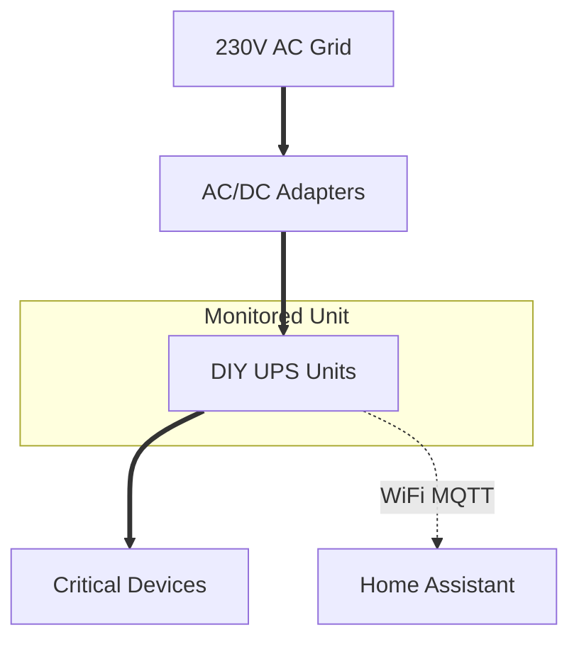

# DIY Smart Home UPS 🔋⚡

A set of modular, low-cost, and smart **Uninterruptible Power Supplies (UPS)** designed to protect and monitor critical smart home devices like Mini PCs, Routers, ONTs, and IP Cameras.

 
*(Left: Wi-Fi Monitored Version | Right: Standard Compact Version)*

---

## 🚀 Overview

This project provides a complete blueprint for building your own DC UPS units for approximately **€10-15**. Unlike standard commercial units, these are designed to be integrated into **Home Assistant** via **MQTT**, providing real-time telemetry of battery health and power grid status.

### Key Features
- **Low Cost:** Built using standard components (€12 for WiFi version, €9 for basic).
- **High Performance:** Up to 24W (35W peak) output, perfect for Mini PCs (Intel N5095) and Routers.
- **Smart Monitoring:** Integrated ESP8266 (Wemos D1 Mini) running **Tasmota**.
- **Seamless Transition:** Zero-millisecond switching between grid and battery power.
- **Autonomy:** 1-2.5 hours of backup time depending on the load.
- **Thermal Tested:** Successfully validated with thermal imaging under 100% load.

---

## 🛠️ Hardware Specifications

### Main Controller: DC UPS V4.0CN (Red Board)
- **Charger:** CN3762 (CC/CV profile for 2S Li-ion).
- **Protection (BMS):** HY2120 + dual FS8205A MOSFETs.
- **Booster:** XR2682 (Step-up to 12V).
- **Cells:** 2x Samsung INR18650-35E (3400mAh, 8A discharge).

### Monitoring Module (WiFi Version)
- **MCU:** Wemos D1 Mini (ESP8266).
- **Power Supply:** ME3116 Buck converter (12V to 5V).
- **Sensors:** Voltage dividers for Vin (Grid status) and Vbat (Analog mapping).

---

## 📊 System Architecture



---

## ⚙️ Software & Integration

### Firmware: Tasmota
The monitoring module uses standard **Tasmota** with a custom template:
- **Profile:** Generic (18)
- **ADC Calibration:** Mapped to 0-9900mV (configurable).
- **MQTT Rules:** Immediate state pushing for `Vin`, `Charging`, and `Done` signals.

### Home Assistant Integration
Includes a custom **MQTT Sensor** and a **Template Sensor** for real-time voltage calculation:

```yaml
# Example Template Sensor
template:
  - sensor:
      - name: "UPS Battery Voltage"
        state: "{{ (states('sensor.ups_battery_voltage_raw') | float * 8.4 / 1023) | round(2) }}"
        unit_of_measurement: "V"
        device_class: voltage
```

---

## 📂 Project Structure

- 📁 `assets/`: Project images, schematics, and thermal captures.
- 📁 `annexes/`: Component datasheets (Samsung, CN3762, XR2682, etc.) and Tasmota backup files.
- 📘 `DIY UPS Project.md`: Complete technical documentation in English.
- 📘 `Proyecto UPS.md`: Documentación técnica completa en Español.

---

## 📸 Gallery

<div align="center">
  
  <p><i>Internal Assembly Diagram</i></p>
  <br>
  
  <p><i>Thermal stress test pass (Visible vs Thermal)</i></p>
</div>

---

## ⚖️ License
This project is for educational and DIY purposes. Always handle Li-ion batteries with care.

---
*Developed for a robust and affordable Smart Home infrastructure.*
